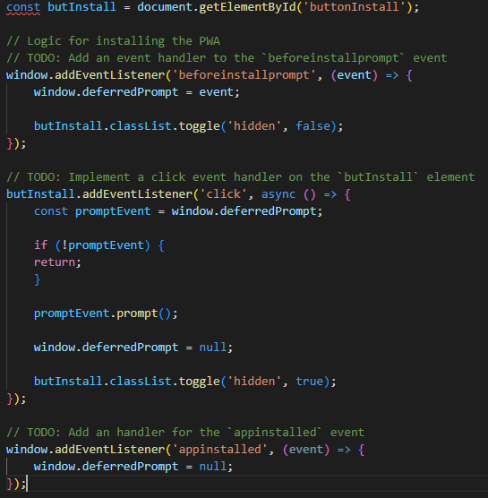
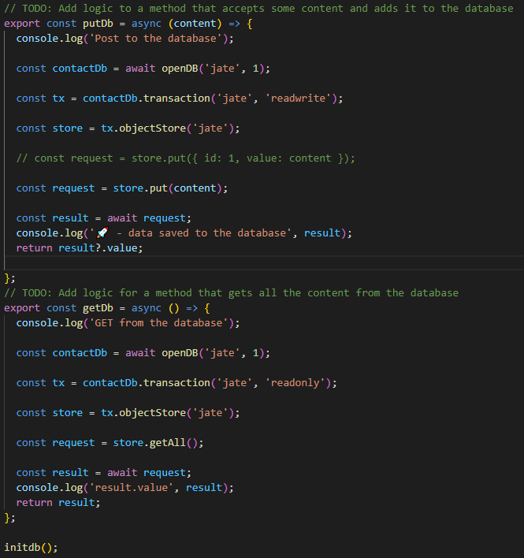
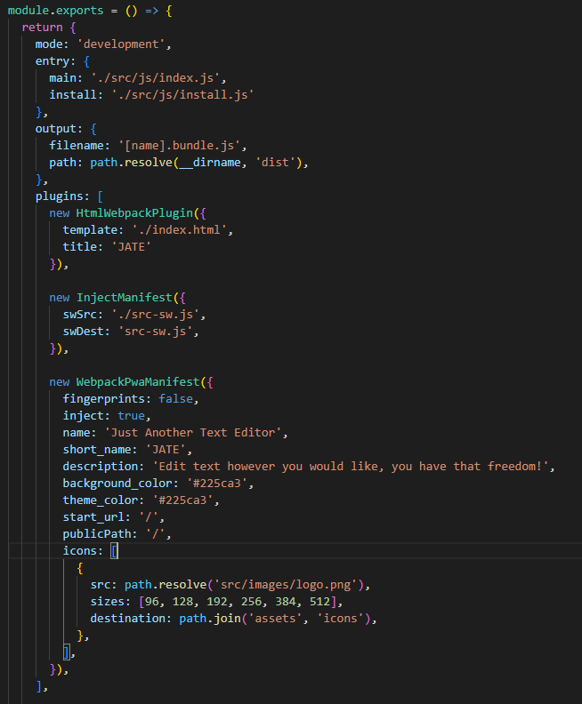
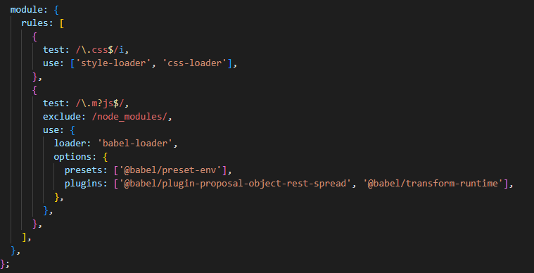
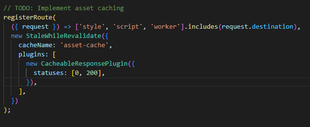

# NBM-PWA-Text-Editor

## USER STORY

    AS A web developer
    I WANT to create a text editor application that can be used and cached while either connected to the internet or offline
    SO THAT users can take notes or develop code without the worry of losing progress if internet cuts out.

## TABLE OF CONTENTS

- [DESCRIPTION](#description)
- [INSTALLATION](#installation)
- [LICENSE](#license)
- [CONTRIBUTING](#contributing)
- [QUESTIONS](#questions)

## DESCRIPTION

J.A.T.E is a text editor that can be

## APPLICATION IN USE

LINK TO DEPLOYED SITE FOUND [HERE](google.com)

## INSTALLATION

Install JS

Database JS

Module Plugins

Module CSS Loader

Asset Cache 

## LICENSE

The license included for the project is under MIT

## CONTRIBUTING

UW Full-Stack Web Development Boot Camp Class Repo - Week 19 PWA (Progressive Web Applications)
https://uwa.bootcampcontent.com/UWA-Bootcamp/uw-blv-virt-fsf-pt-12-2021-u-c/-/tree/master/19-PWA

## QUESTIONS

If you have any further questions about this module or improvement ideas, please feel free to connect on either GitHub or LinkedIn, or email me at:

- GitHub: https://github.com/NathanMilburn
- LinkedIn: https://www.linkedin.com/in/nathan-milburn-55487513a/
- E-Mail: nathan.milburn@outlook.com