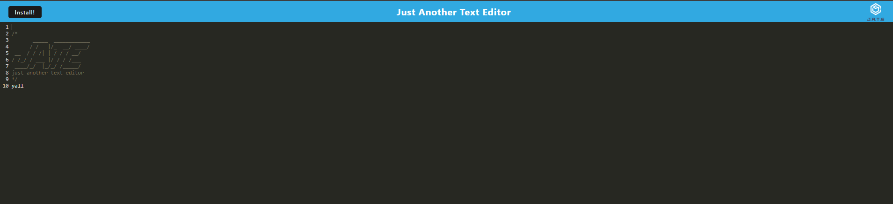

# NBM-PWA-Text-Editor

## USER STORY

    AS A web developer
    I WANT to create a text editor application that can be used and cached while either connected to the internet or offline
    SO THAT users can take notes or develop code without the worry of losing progress if internet cuts out.

## TABLE OF CONTENTS

- [DESCRIPTION](#description)
- [INSTALLATION](#installation)
- [LICENSE](#license)
- [CONTRIBUTING](#contributing)
- [QUESTIONS](#questions)

## DESCRIPTION

J.A.T.E is a text editor that can be installed and used both online and offline using indexedDB data. 

## APPLICATION IN USE

LINK TO DEPLOYED SITE FOUND [HERE](https://warm-chamber-06099.herokuapp.com/)

## INSTALLATION

After bringing in the supplied code from the class repo, my next task was to properly set up the webpack.config.js, src-sw.js, database.js, and install.js files to properly build the application for deployment. 

The webpack configuration required various manifests and plugins to be set up to work in tandem with the service worker, as well as setting up the rules for the css style loader tests.

The service worker file required a method inside of the registerRoute() function that implements asset caching.

The database.js file required getDb and putDb methods that accepts/updates or gets previous information from the indexedDB. 

The install.js file required event listeners for the installation button to react when a player clicks the button and deferrs the prompt from reappearing once clicked. Unfortunately I was not able to get the hidden status to work properly, but all other functionality of the installation button works. 

The final step before pushing to heroku was to troubleshoot any bugs that still remained. My biggest hurdles to overcome were getting the indexedDb information to reappear once the page was refreshed as well as getting the header to display once the page has loaded. This is currently only an issue on my heroku deployed site and is functional on my localhost server. (See image below)

Working Header on localhost:3000

Install JS

Database JS

Module Plugins

Module CSS Loader

Asset Cache 

## LICENSE

The license included for the project is under MIT

## CONTRIBUTING

UW Full-Stack Web Development Boot Camp Class Repo - Week 19 PWA (Progressive Web Applications)
https://uwa.bootcampcontent.com/UWA-Bootcamp/uw-blv-virt-fsf-pt-12-2021-u-c/-/tree/master/19-PWA

## QUESTIONS

If you have any further questions about this module or improvement ideas, please feel free to connect on either GitHub or LinkedIn, or email me at:

- GitHub: https://github.com/NathanMilburn
- LinkedIn: https://www.linkedin.com/in/nathan-milburn-55487513a/
- E-Mail: nathan.milburn@outlook.com